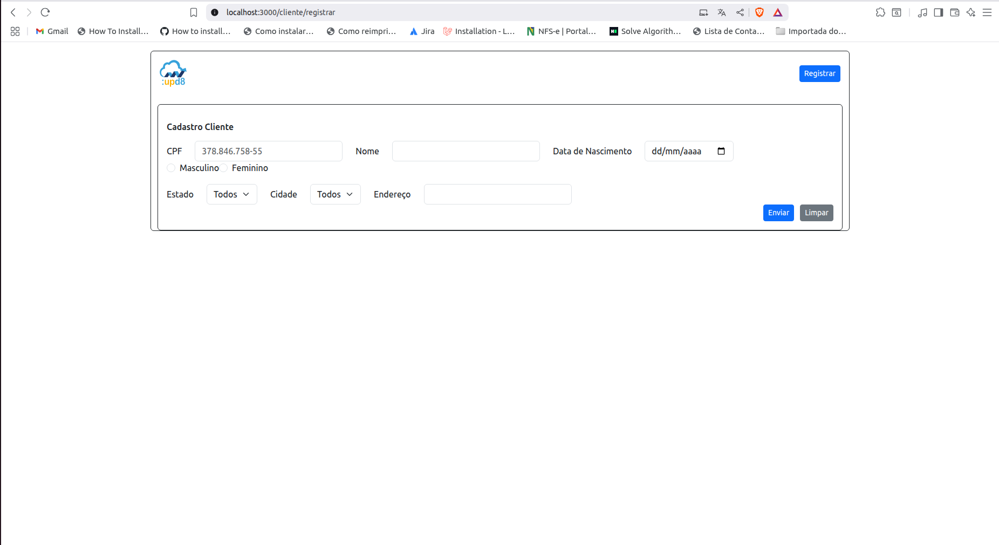

## DESAFIO :UPD8

Telas implementadas a partir do outro desafio conforme este link [upd8backend](https://github.com/SaorCampos/desafio_upd8_back). No projeto de front-end, abordo uma arquitetura limpa e distribuida, dividada em camadas como: Servives, Repositories, Config e Support.

No projeto abordo diversos temas com foco em demonstrar meu conhecimento com ReactJS.

Exploro o ecossistema da biblioteca do ReactJS, utilizando funcionalidades como axios e bootstrap.

### Aplicação Web desenvolvida com: 
- ReactJS 

### Funcionalidades (Atualmente desenvolvidas)
<ul>
    <li>Cadastro de Cliente</li>
    <li>Listagem e Consulta de Clientes</li>
    <li>Edição de Cliente</li>
    <li>Remoção de Cliente</li>
    <li>[Integração com API do IBGE, para consultar as cidades por UF](https://servicodados.ibge.gov.br/api/docs/localidades)</li>
</ul>

### TELAS

### Listagem

### CADASTRO

### EDIÇÃO

## PASSOS:

Detalhes

### Requesitos necessários para executar o projeto:
<ul>
    <li>Instalar o Node versão 22.11.0</li>
    <li>Instalar o axios</li>
    <li>Instalar o bootstrap</li>
    <li>Instalar uma IDE de sua escolha (VSCode)</li>
</ul>

### Executar o projeto:
<ul>
    <li>Clone o projeto ou baixe o arquivo zip</li>
    <li>Adicione o arquivo env.js na pasta ./src/config</li>
    <li>Execute o comando: npm install</li>
    <li>Certifique-se que um diretório chamado `**/node_modules**` foi criado.</li>
    <li>Execute o comando: npm install axios</li>
    <li>Execute o comando: npm install bootstrap</li>
    <li>Execute o comando: npm start</li>
</ul>

### Conectando com API:

> No seu env.js adicione da seguinte forma: 

> const env = { 
>     API_BASE_URL: 'http://localhost:8000/api/' 
> }; 
>  
> export default env; 

### Para iniciar aplicação:
`npm start`
Agora acesse o endereço http://localhost:3000 em seu navegador

## Rotas

### Cliente

[Listagem_Cliente](http://localhost:3000/cliente), 
[Cadastrar_Cliente](http://localhost:3000/cliente/registrar),
[Editar_Cliente](http://localhost:3000/cliente/alterar/{id})

### Representante
[Listagem_Representante](http://localhost:3000/representante),
[Cadastrar_Representante](http://localhost:3000/representante/registrar),
[Editar_Representante](http://localhost:3000/representante/alterar/{id})
